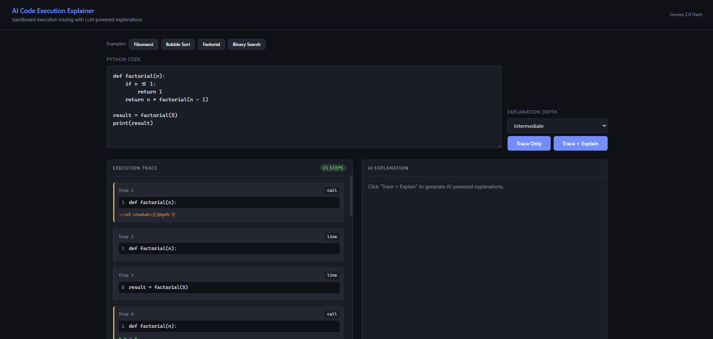

# AI Code Execution Explainer

A trace-based code explainer: sandboxed Python execution with step-by-step variable diffing and LLM-generated explanations at configurable depth (beginner → advanced).



**Setup:** Python 3.10+, Gemini API key in `.env` as `GEMINI_API_KEY`.

```bash
pip install -r requirements.txt
python app.py
```

Open http://localhost:5000.

**API:** `POST /api/trace` — body `{ "code": "..." }`. `POST /api/explain` — body `{ "code": "...", "depth": "beginner"|"intermediate"|"advanced" }`.